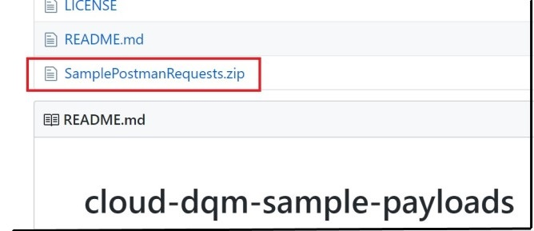
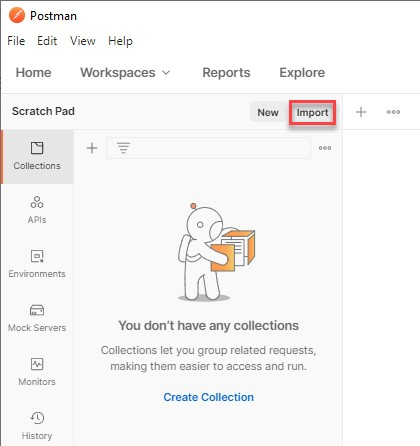
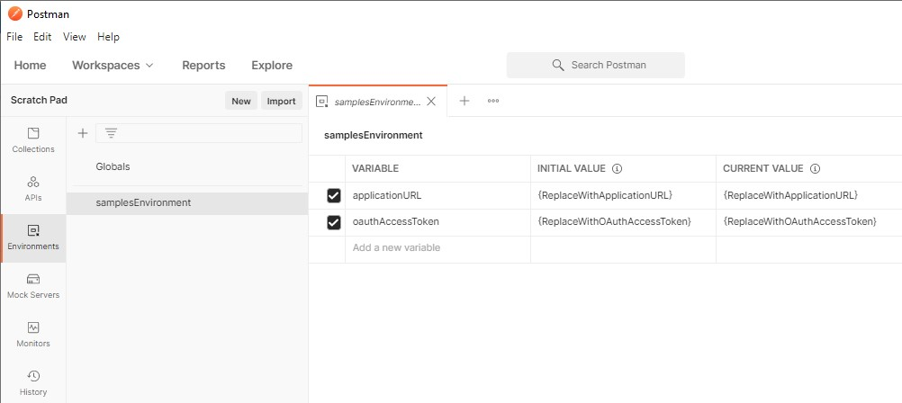
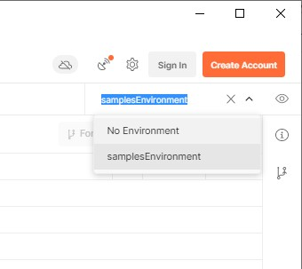
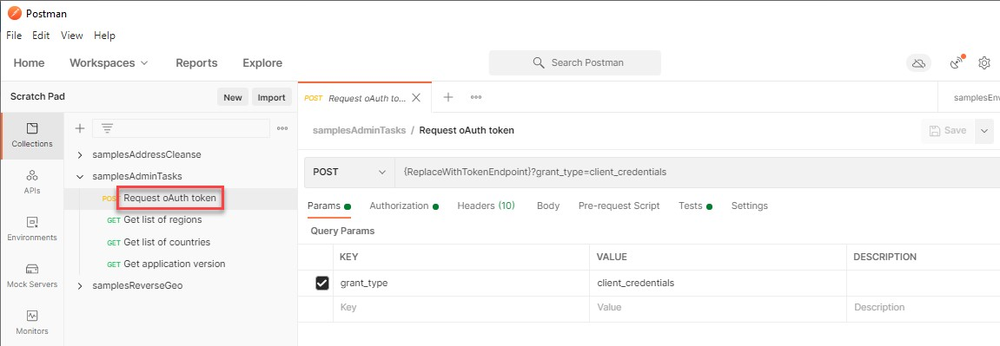
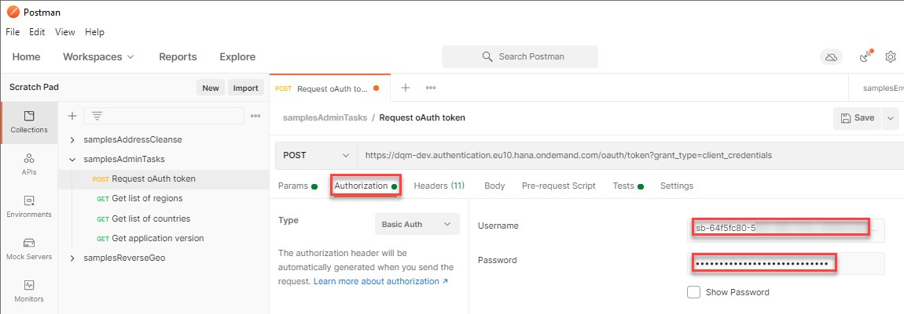
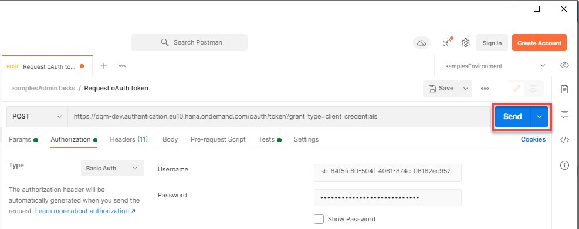
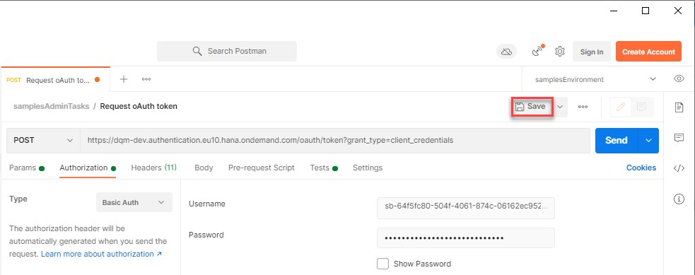

# Sample Payloads for SAP Data Quality Management, microservices for location data
This repository contains sample Postman (www.getpostman.com) Collections as examples for testing the SAP Data Quality Management, microservices for location data service on SAP Business Technology Platform. 

You can find more information about different service plans here:
https://help.sap.com/viewer/d95546360fea44988eb614718ff7e959/Cloud/en-US/a7352caca1a64474b9d98725421b86bf.html

Formal documenation for the serivce can be found here: https://help.sap.com/viewer/d95546360fea44988eb614718ff7e959/Cloud/en-US

## Quick Start

By using these sample collections for the Postman app, you can quickly get started testing Data Quality Management, microservices.

## Download Postman App

Download the Postman app for Chrome at https://www.getpostman.com

## Download the Samples

1. Download the SamplePostmanRequests.zip file 

2. Extract the four sample .json files to your file system.

## Import Collections

1. Launch the Postman app.
2. Click the Import button.

3. Select Upload Files.
4. Browse for the four .json files that were downloaded and extracted in the previous step. Select Open, then Import.
    * samplesAddressCleanse.postman_collection.json
    * samplesAdminTasks.postman_collection.json
    * samplesEnvironment.postman_environment.json
    * samplesReverseGeo.postman_collection.json

## Result
Three collections are added: 
   * samplesAddressCleanse 
   * samplesAdminTasks
   * samplesReverseGeo 
   
   To see a sample request, select Collections in the navigation panel, and select a collection name to expand it. The samplesAddressCleanse collection has multiple folders, therefore select a folder name to expand it. Select one of the sample request names to see the body of the request.

One environment is added – samplesEnvironment. To see the variables, select Environments in the navigation panel, and select the samplesEnvironment name.

The samplesEnvironment environment is also available to select in the active environment combo box.

## Update Environment Variables

You must update both variables in the samplesEnvironment environment.

1. On the SAP Business Technology Platform, navigate into your subaccount and access the Credentials window that includes the contents of the service key. If you are not familiar with how to do this, see the instructions or the video on the Accessing DQM Microservices page of the SAP Help Portal.
2. The value for the applicationURL variable is the value for the "uri" property in the Credentials window, but you must include the prefix "https://" and the suffix "/dq". Enter that value in Postman as the current value.

3. To get the value for the oauthAccessToken variable you will get values from the Credentials window to enter in one of the sample requests, and send the request. Begin by selecting Collections in the navigation panel, expanding the samplesAdminTasks collection, and selecting the "Request oAuth token" sample request. 

4. In the URL replace {ReplaceWithTokenEndpoint} with the value for the "url" property in the Credentials window, but you must include the suffix "/oauth/token". Enter that value in Postman in the URL in place of {ReplaceWithTokenEndpoint}, being careful to keep the "?". (The host for your token endpoint will be slightly different than the host shown in the following screen shot.)

5. Go to the Authorization tab. In the Username replace {ReplaceWithClientID} with the value for the "clientid" property in the Credentials window, and in the Password replace the masked characters with the value for the "clientsecret" property in the Credentials window.

6. Make sure samplesEnvironment is selected in the active environment combo box.

7. Send the request by selecting the Send button.

8. The value for the oauthAccessToken appears in the response in the lower pane of Postman in the access_token property. You do not have to copy the value because the sample request includes a script in the Tests tab that automatically transfers the access_token value to the active environment. Select Environments in the navigation panel, and select the samplesEnvironment name to confirm that the value is transferred successfully.

9. Save the sample request "Request oAuth token". The access token expires after 12 hours and you will have to resend this sample request each day of your testing period to generate a new one.

## Send Sample Requests

1. Select Collections in the navigation panel, expand the samplesAddressCleanse collection and then expand the Address Cleanse folder. Select one of the sample requests. You may see the body of the request in the Body tab.

2. Select the Send button. The response is returned in the lower pane of Postman.
3. You may change the address in the addressInput object and send the request to test other addresses.

## How to obtain support
SAP does not provide support for the sample code, but you can discuss the tool with other users on the [SAP Community](https://answers.sap.com/questions/ask.html).

## License
Copyright (c) 2022 SAP SE or an SAP affiliate company. All rights reserved. This project is licensed under the Apache Software License, version 2.0 except as noted otherwise in the [LICENSE](/LICENSE) file.